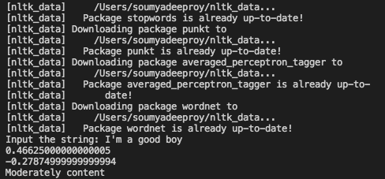

# Niftee_NLP_Package
<h2> Downloading the dependencies</h2>

To download the dependencies in Python, route your current path to this directory in cmd and then run the below line(after cloning the repository)

<code> pip install -r requirements.txt </code>

 This will download all the necessary dependencies for this code

<h2> How to Run the code</h2>

 After cloning the repo and routing to the directory where the repo is stored, in your command prompt please run the command 

<code> python main.py </code>

And it will ask you for a input string, you can type it there, e.g: I'm a good guy, and it will throw the Valence, arousal, emotion tag in the cmd window itself

